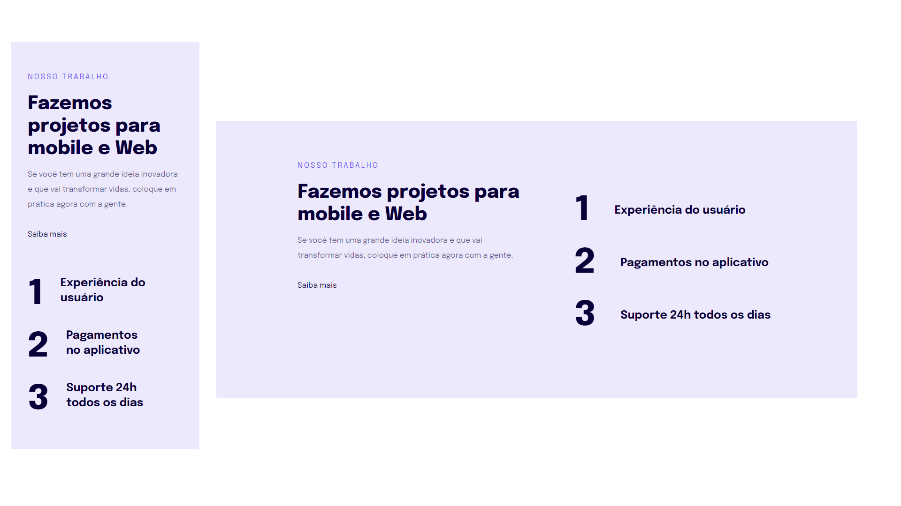

  

## 🖥️ Projeto
Projeto simples para o aprendizado de responsividade utilizando a ideia do mobile first, além de aprender a utilizar unidades de medidas mais flexivéis e de fácil ajuste em diferentes telas.

## 🚀 Tecnologias
Foi desenvolvido esse projeto no programa Explorer da Rocketseat no stage 02.

- HTML
- CSS
- GIT
- GITHUB
- FIGMA

## 👁 View
Aqui você pode visualizar o layout do projeto
<a 
  href="https://www.figma.com/file/c0HyXK6sRAv0B3WE6S6Ndm/Explorer-Stage-03-Projeto-02-(Copy)?type=design&t=2g9y3wSxCcupU0xi-0" target="_blank">clique aqui</a>
